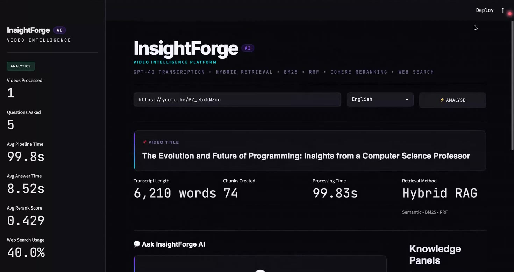
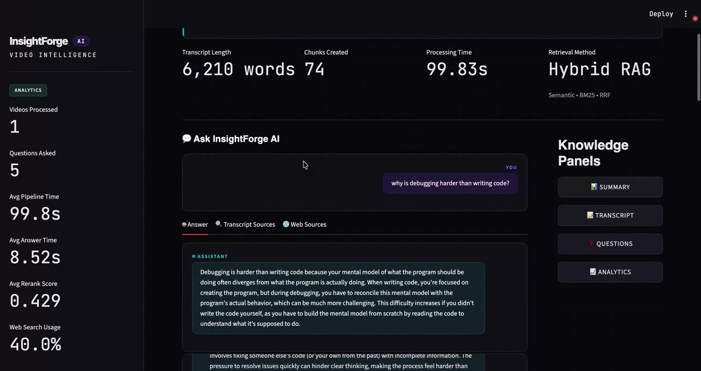
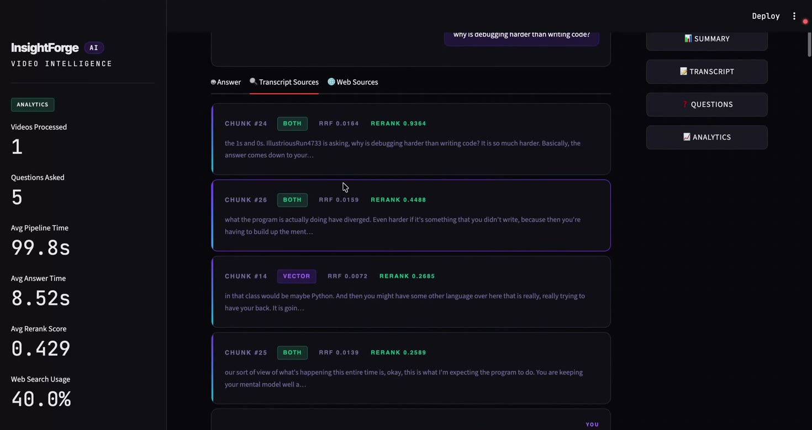
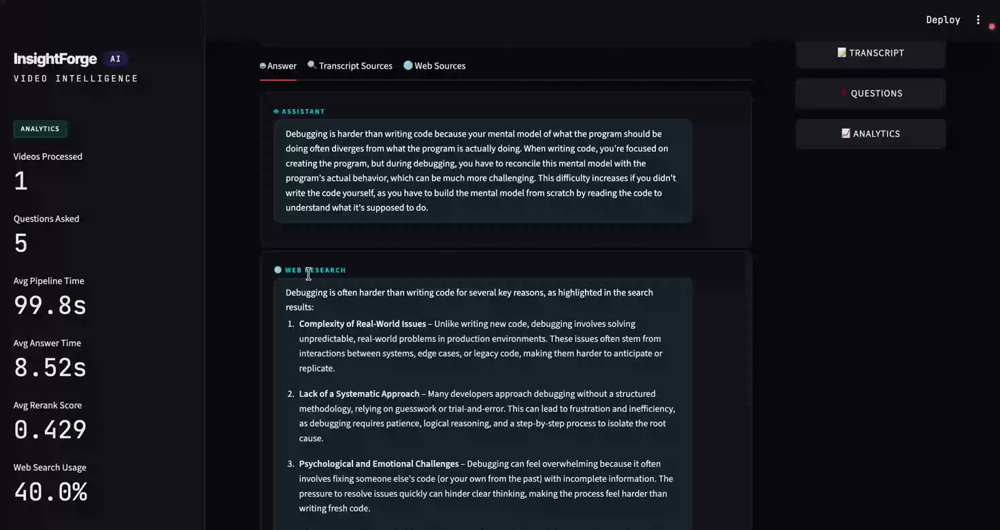
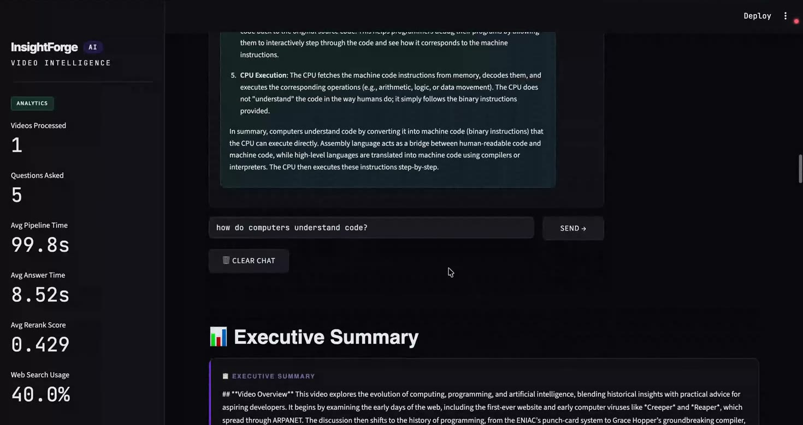
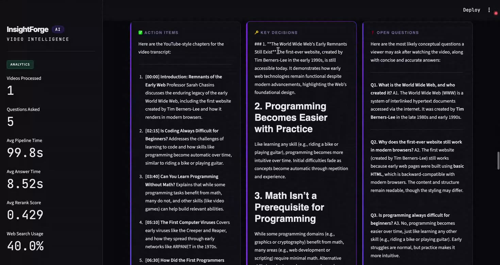
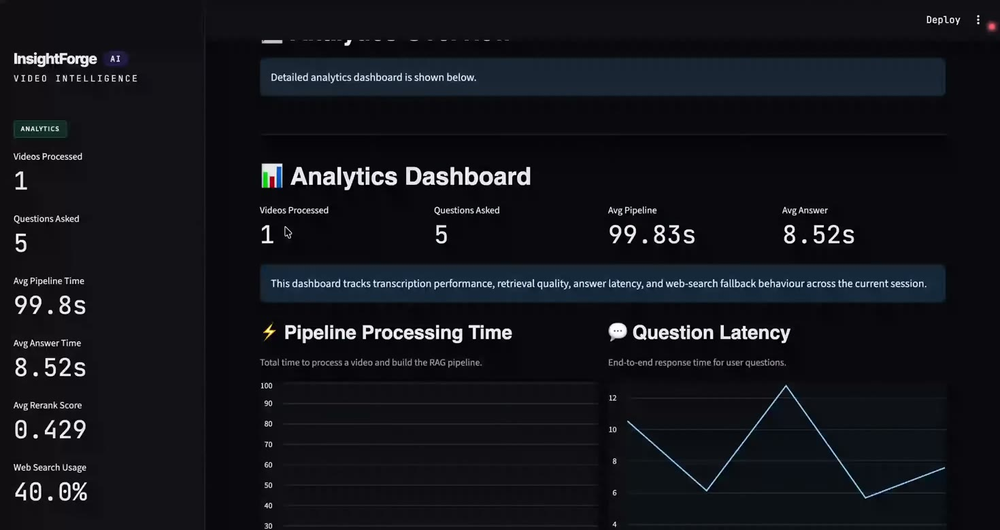
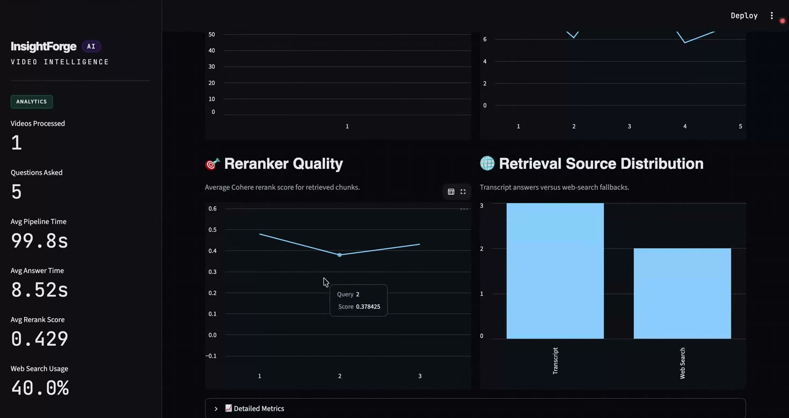
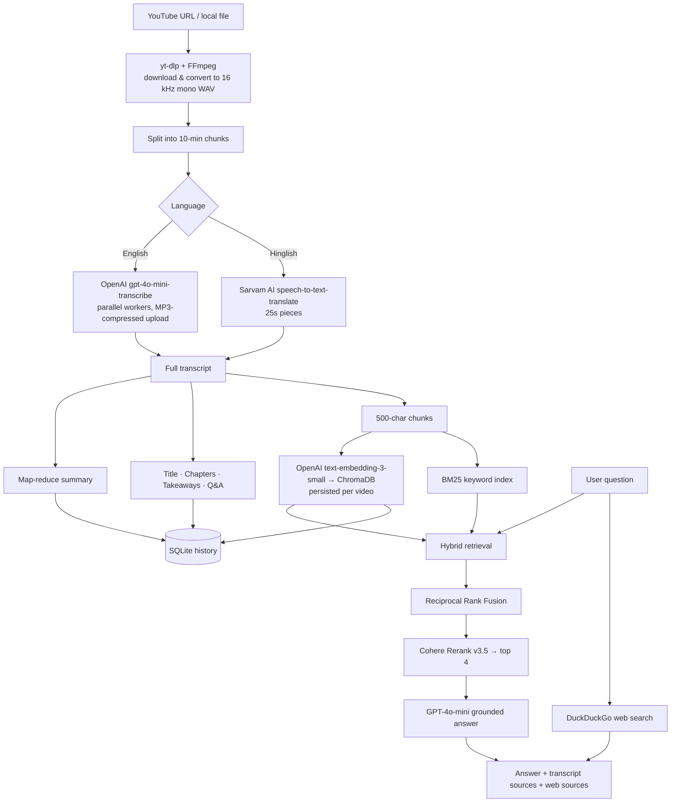

# 🎬 InsightForge AI

**Turn any YouTube video or recording into a searchable knowledge base. You get a summary, chapters, key takeaways and Q&A, and you can chat with the video.**

### 🔗 Live demo: **[insightforge--ai.streamlit.app](https://insightforge--ai.streamlit.app/)** · ▶️ [Watch the video walkthrough](https://youtu.be/_WRUkaEJAgk)




---

## The problem

Long videos (lectures, meetings, podcasts, tutorials) hold useful information, but finding one answer means scrubbing through an hour of footage. Plain transcripts help a little, but you still can't *ask* them anything.

## What InsightForge AI does

Paste a YouTube link or a local file path, pick a language, and click **Analyse**. A few minutes later you have:

| Output | What you get |
|---|---|
| 🏷️ **Title** | A short, professional title generated from the content |
| 📊 **Executive summary** | A structured overview: main topics, key insights and a conclusion |
| 🧭 **Chapters** | YouTube-style `[MM:SS]` chapters, each with a one-click **▶ jump** that seeks the video player |
| 💡 **Key takeaways** | What a viewer should remember, with short explanations |
| ❓ **Q&A** | 5–15 likely viewer questions, already answered |
| 💬 **Chat with the video** | Ask anything. Answers come from the transcript and cite their sources, and a web-search answer comes alongside |
| 📄 **Export** | Download the full report as **PDF** or **TXT** |
| 🕘 **History** | Every processed video is saved. Reopen it from the sidebar with no re-processing and no extra API cost |
| 📈 **Analytics** | Pipeline latency, question latency, reranker quality and retrieval-source distribution |

Works with **English** and **Hinglish** (Hindi + English) audio. Hinglish is transcribed *and translated* to English by Sarvam AI.

---

## Screenshots

[](https://youtu.be/_WRUkaEJAgk)
<p align="center"><em>▶️ Click to watch the full walkthrough on YouTube</em></p>

<table>
  <tr>
    <td width="50%"><br><b>Chat with the video:</b> answers grounded in the transcript</td>
    <td width="50%"><br><b>Explainable retrieval:</b> each chunk shows how it was found (BM25 / vector / both), its RRF score and its rerank score</td>
  </tr>
  <tr>
    <td><br><b>Web augmentation:</b> a DuckDuckGo-backed answer alongside the transcript answer</td>
    <td><br><b>Executive summary:</b> map-reduce summary of the whole video</td>
  </tr>
  <tr>
    <td><br><b>Chapters · Takeaways · Q&A:</b> generated side by side</td>
    <td><br><b>Analytics dashboard:</b> pipeline and question latency</td>
  </tr>
  <tr>
    <td colspan="2"><br><b>Retrieval quality:</b> Cohere rerank scores per query and transcript-vs-web answer distribution</td>
  </tr>
</table>

---

## Architecture



---

## How it works, step by step

### 1. Audio ingestion (`utils/audio_processor.py`)
- **YouTube:** `yt-dlp` downloads only the best audio stream (using the Android player client to avoid common blocks), and FFmpeg converts it to WAV.
- **Local files:** `pydub` converts any audio/video format to **16 kHz mono WAV**, which is what speech models expect.
- The audio is cut into **10-minute chunks** so long videos never hit API size limits. Temp files are always cleaned up in a `finally` block.

### 2. Transcription (`core/transcriber.py`)
- **English:** each chunk is compressed to 64 kbps MP3 (much faster uploads with no loss in speech accuracy) and sent to **OpenAI `gpt-4o-mini-transcribe`**.
- **Hinglish:** Sarvam's sync API only accepts ≤30 s of audio, so each chunk is sliced into 25 s pieces and sent to **Sarvam `saaras`**, which transcribes and translates to English in one step.
- Chunks are transcribed **in parallel** with a `ThreadPoolExecutor` (worker count is configurable), and their order is preserved.

### 3. Content intelligence (`core/summarizer.py`, `core/extractor.py`)
- **Map-reduce summarization:** the transcript is split into 3,000-character chunks, each chunk is summarized, and the partial summaries are merged into one structured report. This works on videos of any length without overflowing the context window.
- Separate **LangChain LCEL** chains, each with its own prompt, generate the title, chapters, key takeaways and Q&A.
- `utils/chapter_parser.py` parses the `[MM:SS]` chapter output into timestamps so the UI can seek the video player.

### 4. Knowledge base (`core/vector_store.py`)
- The transcript is split into 500-character chunks with 50-character overlap.
- **Dense index:** chunks are embedded with OpenAI `text-embedding-3-small` and stored in **ChromaDB**, which keeps a *persistent collection per video* on disk.
- **Sparse index:** a **BM25** retriever catches exact terms, names and acronyms that embeddings often miss.

### 5. Hybrid retrieval + reranking
1. Fetch ~20 candidates from **both** vector search and BM25.
2. Merge the two ranked lists with **Reciprocal Rank Fusion (RRF)**, implemented from scratch with configurable weights.
3. Re-score the fused candidates with **Cohere Rerank v3.5** and keep the top 4.
4. Every source records whether it was found by `vector`, `bm25` or `both`, plus its RRF and rerank scores, so you can see exactly why each chunk was chosen.

### 6. Grounded answering + web augmentation (`core/rag_engine.py`)
- GPT-4o-mini answers **only from the retrieved transcript context**. If the answer isn't in the video, it says so instead of making something up.
- A **DuckDuckGo** search runs alongside it. When the transcript can't answer, the web answer is shown on its own. Otherwise both appear, each with its sources.

### 7. Persistence & reliability
- **SQLite history** (`core/history_store.py`): transcript, summary, chapters, takeaways, Q&A and chunks are stored under a stable video ID (the YouTube ID, or a hash for local files). Reopening a video reattaches its saved Chroma collection and rebuilds BM25, so it needs **zero** new API calls.
- **Retry with exponential backoff** (`utils/retry.py`) wraps every external call: OpenAI, Sarvam and Cohere.
- **Startup environment check** (`utils/env_check.py`) shows a clear error in the UI when a required API key is missing, instead of crashing halfway through.

---

## Tech stack

| Layer | Tools |
|---|---|
| UI | Streamlit (custom dark theme) |
| Orchestration | LangChain (LCEL chains) |
| Speech-to-text | OpenAI `gpt-4o-mini-transcribe`, Sarvam AI `saaras` |
| LLM | OpenAI `gpt-4o-mini` |
| Embeddings | OpenAI `text-embedding-3-small` |
| Vector DB | ChromaDB (persistent, per video) |
| Keyword search | BM25 (`rank_bm25`) |
| Reranking | Cohere Rerank v3.5 |
| Web search | DuckDuckGo |
| Audio | yt-dlp, FFmpeg, pydub |
| Storage | SQLite |
| Export | fpdf2 |
| Deployment | Streamlit Community Cloud |

---

## Project structure

```
├── app.py                  # Streamlit UI: input, pipeline progress, results, chat, analytics
├── core/
│   ├── transcriber.py      # OpenAI / Sarvam transcription, parallel workers
│   ├── summarizer.py       # Map-reduce summary + title generation
│   ├── extractor.py        # Chapters, key takeaways, Q&A chains
│   ├── vector_store.py     # Chroma + BM25, RRF fusion, Cohere rerank (HybridRetriever)
│   ├── rag_engine.py       # Grounded QA + DuckDuckGo web augmentation
│   └── history_store.py    # SQLite persistence of processed videos
├── utils/
│   ├── audio_processor.py  # Download, convert, chunk audio
│   ├── chapter_parser.py   # Parse "[MM:SS] Title" chapters into seekable timestamps
│   ├── exporter.py         # PDF / TXT report builders
│   ├── retry.py            # Exponential-backoff retry helper
│   └── env_check.py        # Validate required API keys
├── requirements.txt
├── runtime.txt             # Python version for Streamlit Cloud
└── .env.example            # Template for API keys
```

---

## Run it locally

### Prerequisites
- Python **3.11**
- **FFmpeg** installed and on your PATH
  - macOS: `brew install ffmpeg`
  - Ubuntu/Debian: `sudo apt install ffmpeg`
  - Windows: `winget install ffmpeg`
- API keys: **OpenAI** and **Cohere** (plus **Sarvam AI** if you want Hinglish support)

### Setup

```bash
# 1. Clone
git clone https://github.com/deepanshu946/InsightForge-AI.git
cd InsightForge-AI

# 2. Create a virtual environment
python3.11 -m venv venv
source venv/bin/activate          # Windows: venv\Scripts\activate

# 3. Install dependencies
pip install -r requirements.txt

# 4. Add your API keys
cp .env.example .env              # then edit .env and paste your keys

# 5. Launch
streamlit run app.py
```

Open http://localhost:8501, paste a YouTube URL, and click **⚡ Analyse**.

### Environment variables

| Variable | Required | Purpose |
|---|---|---|
| `OPENAI_API_KEY` | ✅ | Transcription, LLM, embeddings |
| `COHERE_API_KEY` | ✅ | Reranking |
| `SARVAM_API_KEY` | Hinglish only | Hinglish → English transcription |
| `OPENAI_TRANSCRIBE_MODEL` | – | Default `gpt-4o-mini-transcribe` |
| `SARVAM_STT_MODEL` | – | Default `saaras:v2.5` |
| `MAX_TRANSCRIPTION_WORKERS` | – | Parallel transcription workers (default `5`) |

---

## Engineering highlights

- **Hybrid search done properly:** dense + sparse retrieval, a custom RRF implementation and a cross-encoder reranker. This is the retrieval stack production RAG systems use, not a basic "embed and cosine" setup.
- **Explainable answers:** every answer shows which chunks were used, how each one was found, and its scores.
- **Handles long inputs:** audio chunking, parallel transcription and map-reduce summarization mean a 2-hour video works the same way a 5-minute one does.
- **Cost-aware:** MP3 compression before upload, and results cached in SQLite + persistent Chroma so reopened videos cost nothing.
- **Resilient:** exponential-backoff retries on every network call, upfront key validation, and guaranteed temp-file cleanup.
- **Multilingual:** language-based routing to a specialist Indic speech model for Hinglish content.

## Roadmap

- Speaker diarization ("who said what")
- Ask questions across multiple videos at once
- Retrieval evaluation suite (RAGAS)
- User accounts and team workspaces

---

## 👤 Author

**Deepanshu Agarwal**: AI / LLM application developer, available for freelance work.

I build RAG systems, AI assistants and LLM-powered tools, from prototype to deployment.

- GitHub: [@deepanshu946](https://github.com/deepanshu946)
- Email: [deepanshuagarwal946@gmail.com](mailto:deepanshuagarwal946@gmail.com)

If you'd like something like this built for your business, get in touch.
